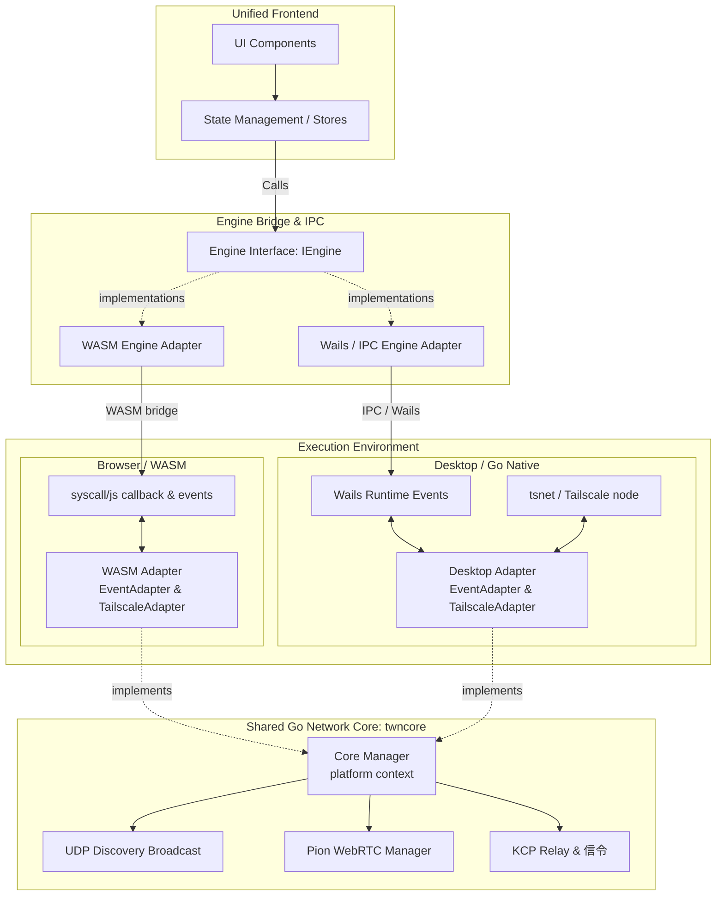

# Astraea Architecture

## 架构解释 (Architecture Explanation)

1. **统一前端 (Unified Frontend)**: UI 是严格针对 `IEngine` 接口编程的。它不知道自己是在浏览器中运行还是在桌面应用程序中运行。
2. **引擎桥接 (Engine Bridge)**: 它解析了平台执行环境。你需要提供 `WebEngine` 或 `DesktopEngine` 来满足 `IEngine` 接口的要求。
3. **执行环境 (Execution Environment)**: 
   - 使用 `syscall/js` 进行 WASM 执行，并注入平台适配器。
   - 对桌面应用使用 `Wails + tsnet`，并通过 Wails 运行时处理事件路由。
4. **共享 Go 网络核心 (`twncore`)**: 它是协议栈的绝对单一真相来源 (single source of truth)。它不了解 `Wails` 或 `WASM` 的具体实现细节。它仅通过初始化时注入的 `TailscaleAdapter`（用于网络）和 `EventAdapter`（用于下游 UI 通信）来工作。